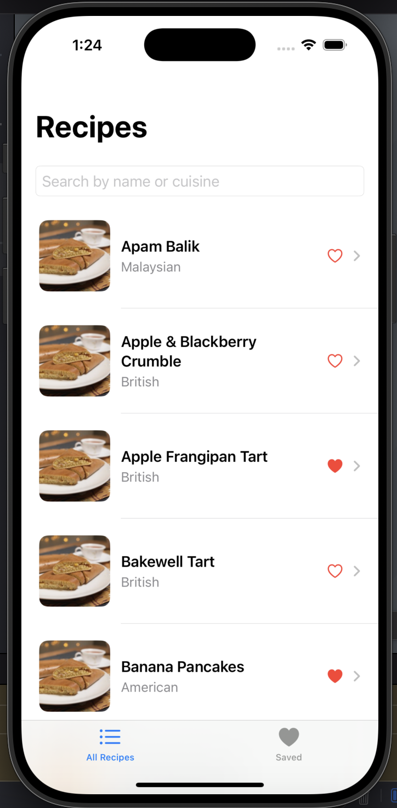
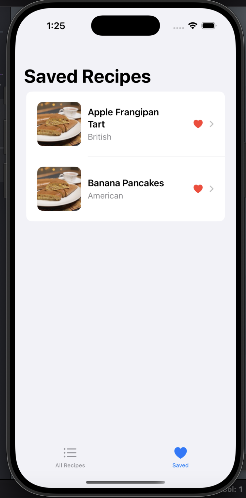
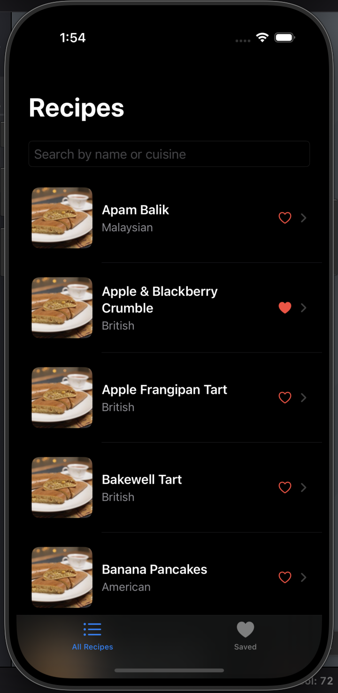

# 🍽️ Fetch Recipe App

I created a modern SwiftUI based recipe app built for the Fetch mobile take-home project.  
This app displays recipes from the remote API, with search, save (favorites), and image caching — all implemented using Swift Concurrency (`async/await`) and 100% native Apple frameworks.

---

## 📸 Screenshots

| Main List | Saved Recipes |
|----------|---------------|
|  |  |  |

---

## ✨ Features

### 🔍 Search Recipes
- Search instantly by name or cuisine
- Real-time filtered list updates as you type

### ❤️ Favorite Recipes
- Tap the heart to add/remove favorites
- Heart turns red when saved

### 📂 View Saved Recipes
- Second tab shows all your favorited recipes
- Tap to open details or unfavorite anytime

### 📷 Custom Image Caching
- Loads images only when needed
- Caches to disk and memory (fully custom, no `URLCache` or third-party code)

### 🌗 Dark Mode Support
- The app automatically adapts to the system’s light/dark mode settings.

### 🧪 Unit Testing
- `RecipeServiceTests`: fetch, empty state, and malformed error handling
- `ImageCacheTests`: checks memory and disk cache flow

### 🧠 Clean Architecture
- `MVVM` pattern using `@MainActor` ViewModel
- Separated `Models`, `Services`, `ViewModels`, and `Views` for clarity

### 💡 Modern SwiftUI
- Fully SwiftUI-based interface
- Dark mode supported
- `NavigationStack`, `AsyncImage`, `TabView`, `.refreshable`, `@EnvironmentObject` all used properly

---

## 🧠 Focus Areas

I focused on:
- A clean and responsive SwiftUI UI
- Efficient async image loading with custom caching
- Core UX enhancements like favorites and search
- Robust structure for maintainability (MVVM)

---

## ⏱ Time Spent

Approx. **3 days** total:
- Reading and understandin requirements: 6 hrs
- UI & state logic: 1 day
- Favorites + search: 12 hrs
- Image caching: 12 hrs
- Testing: 12 hr
- Cleanup + commenting + README: 6 hrs

---

## ⚖️ Trade-offs

- Favorites are stored in-memory, not persisted (could add `UserDefaults`)
- No mock URL session injected for testing (used live endpoints instead)
- UI tests skipped per instructions

---

## 🔍 Weakest Area

Currently, saved recipes are lost on app restart.  
With more time, I would persist this using `AppStorage` or `UserDefaults`.

---

## 📎 Setup

1. Clone the repo
2. Open `FetchRecipeApp.xcodeproj` in Xcode
3. Run on iOS 16+ simulator or device
4. Use the test suite via `⌘ + U` to verify logic

---

## ✅ Requirements Met

- ✅ `async/await` used for API + image calls
- ✅ No third-party libraries used
- ✅ Efficient image caching fully implemented
- ✅ SwiftUI used throughout
- ✅ Core logic unit tested
- ✅ Handles malformed & empty data cases
- ✅ Enhanced with extra features (favorites, search, tabs)

---

## 👋 Extra Notes

- Tested with valid endpoints
- Handles edge cases gracefully (loading, no results, broken images)
- Built using Xcode 15 for iOS 16 and up

---

## 🏁 Submit

Thank you for the opportunity to build this!

